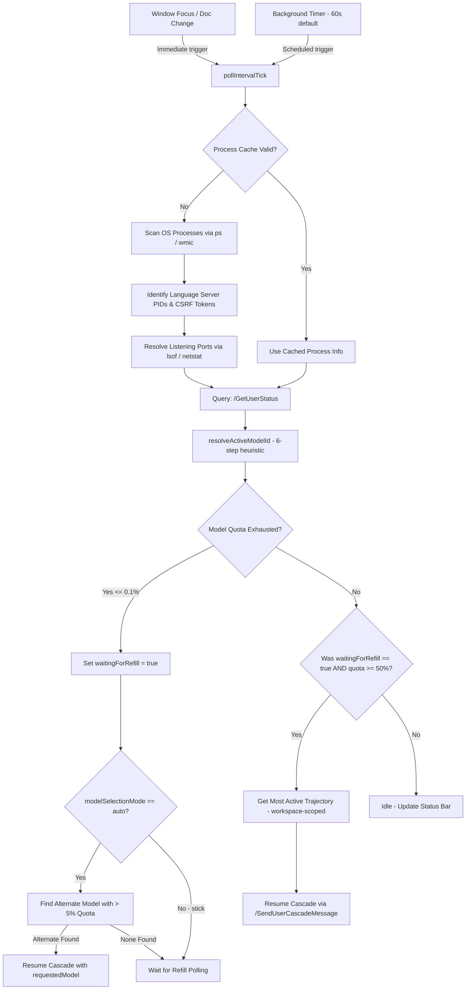

# Architecture & Implementation Details

This document explains how the Antigravity Credit Auto-Resumer extension detects when the agent session is active, identifies credit exhaustion, and handles automated continuation prompts once credits are refilled or model configurations are adjusted.

For a detailed breakdown of the model detection logic specifically, see [docs/model-detection.md](model-detection.md).

---

## High-Level Architecture Flow

The auto-resumer runs on a background polling interval supplemented by event-driven triggers. During each tick, it executes process discovery, reads credit balances, evaluates active agent sessions, and triggers continuation actions if quotas reload or alternative models are selected.



---

## Technical Mechanisms

### 1. Process and Dynamic Port Discovery

Before any request is sent, the extension must locate the running Antigravity server and its dynamic communication ports.

* **Command Scanning**: In [process-detector.ts](../src/process-detector.ts), the `detectProcesses` function runs a dynamic OS process check (`ps -ax` on macOS/Linux or `wmic` on Windows) to search for command lines with `language_server` and `--csrf_token`.
* **Port Resolution**: In `resolvePortsForPid`, the tool scans listening TCP ports associated with the language server PID (`lsof -nP -iTCP -sTCP:LISTEN -p <pid>` on macOS or `netstat -ano` on Windows).
* **Caching**: Process information (PID, CSRF token, resolved ports) is cached in-memory in [extension.ts](../src/extension.ts). The extension performs a fast verification tick and only spawns process scanning shell commands if the cache is empty or every fourth tick to minimize CPU overhead.
* **Survival Sweeps**: Cached processes are only evicted if `process.kill(pid, 0)` returns `ESRCH` (process not found). `EPERM` errors from permission-restricted processes do **not** trigger eviction.

### 2. Credit and Quota Monitoring

To track credit pools and active model quotas, the extension requests status updates from the language server.

* **Endpoint**: HTTPS POST to `/exa.language_server_pb.LanguageServerService/GetUserStatus`
* **Security & Protocol**: Requests bypass local self-signed TLS verification (`rejectUnauthorized: false`) and include the Connect protocol and CSRF token headers:
  ```http
  Connect-Protocol-Version: 1
  X-Codeium-Csrf-Token: <discovered-token>
  ```
* **Active Model Resolution**: The active model is resolved via `resolveActiveModelId()` — a 6-step heuristic combining trajectory metadata, quota deltas, and configuration overrides. See [docs/model-detection.md](model-detection.md) for the full breakdown.
* **Quota Exhaustion Evaluation**: If the resolved model's `remainingFraction` ≤ 0.001 (≤ 0.1%), the model is classified as exhausted. The status bar background shifts to warning/error and the extension transitions into a `waitingForRefill` state.
* **Refill Detection**: A model transitions back to available when its `remainingFraction` rises from depleted or low quota (< 5%) to ≥ 50%. This threshold captures refill events that occurred between polling intervals.

### 3. Active Session (Trajectory) Detection

To resume the correct conversation, the system must identify the conversation that was active when the credits ran out.

* **Endpoint**: `/exa.language_server_pb.LanguageServerService/GetAllCascadeTrajectories`
* **Workspace Scoping**: The response contains all trajectories across all open workspaces. The extension filters to those matching the target process's `workspaceId` (derived from the workspace root URI) before selecting the most recent one.
* **Active Conversation Heuristics**: From the workspace-matching trajectories, the extension targets the one with the latest `lastModifiedTime` or `lastUserInputTime` timestamp. If no timestamps are present it falls back to the first trajectory in the list.

### 4. Automated Continuation Trigger

When the resumer decides to continue the session (either because the quota refilled or an alternative model was selected):

* **Endpoint**: HTTPS POST to `/exa.language_server_pb.LanguageServerService/SendUserCascadeMessage`
* **Payload Structure**:
  ```json
  {
    "message": "continue",
    "selectedCascadeId": "<active-trajectory-id>",
    "requestedModel": {
      "model": "<selected-model-id>"
    },
    "metadata": {
      "ideName": "antigravity",
      "extensionName": "antigravity",
      "locale": "en"
    }
  }
  ```
* **Status Updates & Logs**: Upon successful resumption, toast notifications are displayed and the resumption is logged to both the `Antigravity Credit Resumer Activity` output channel and the persistent history file.

---

## Persistent Logging

All activity and debug output is mirrored to local disk files inside the active workspace under `.logs/`.

### Log Files

| File | Contents |
|---|---|
| `.logs/resumer-debug.log` | All activity channel messages; high-frequency tick details only when `debugLogging` is enabled |
| `.logs/resumer-history.md` | Append-only Markdown table of high-level events (initialization, exhaustion, model switches, resumptions) |

### Log Rotation

On extension activation, if `resumer-debug.log` exceeds **5 MB** it is renamed to `resumer-debug.log.bak` (overwriting any previous backup) and a fresh log file is started. This prevents unbounded disk growth during long-running overnight sessions.

### History Report Format

`resumer-history.md` entries are written in Markdown table format and include: timestamp, PID of the monitoring window, event type, and event details. The PID column allows log entries from multiple simultaneously open VS Code windows to be distinguished.

### Fail-Safe

Folder creation and file write failures (restricted permissions, disk full) do **not** crash the extension or interrupt the background polling loop.

---

## Sleep / Suspend & Power Management Behavior

For overnight execution or long-term automated runs, it is critical to understand how the extension interacts with host power-saving states.

### The Sleep / Standby Freeze

When the host computer enters a sleep, standby, or suspend state:

* **Timer Deactivation**: The CPU pauses, freezing the Node.js event loop in the VS Code extension host. All background checking intervals (`setInterval`) are paused.
* **No Auto-Wake**: The extension runs in standard user-space and does NOT have administrative access to schedule hardware Real-Time Clock (RTC) wake timers. It cannot wake the computer up when credit refills occur.

### Automatic Wake-up Resumption Lifecycle

When the user manually wakes the laptop (e.g., opening the lid or pressing a key):

1. **Immediate Evaluation Tick**: The JavaScript engine resumes the event loop, registers that the interval has elapsed, and immediately runs one sweep of `pollIntervalTick()`.
2. **Network Delays**: If the system wakes up before the network interface (Wi-Fi/Ethernet) reconnects, the local language server fails to fetch updated credit status from the cloud. The tick logs a warning and remains in the `waitingForRefill` state.
3. **Auto-Recovery**: On the subsequent polling tick (or after network re-association), the query to `/GetUserStatus` succeeds, detects the refill, and triggers `SendUserCascadeMessage` to resume the active cascade automatically.

### Workarounds to Prevent Sleep During Overnight Runs

To ensure cascades run and resume unattended overnight, the computer must be prevented from entering standby:

* **macOS Caffeinate**: Run the native `caffeinate` command in the terminal to keep the OS awake indefinitely:
  ```bash
  caffeinate
  ```
  *(Or `caffeinate -u -t 7200` to prevent sleep for 2 hours.)*
* **Windows PowerToys Awake**: Enable the PowerToys Awake utility in the system tray to keep the PC active on-demand.
* **Power Configurations**: Set the computer's plugged-in sleep timer to "Never" in the system settings (while allowing the display to turn off safely).
