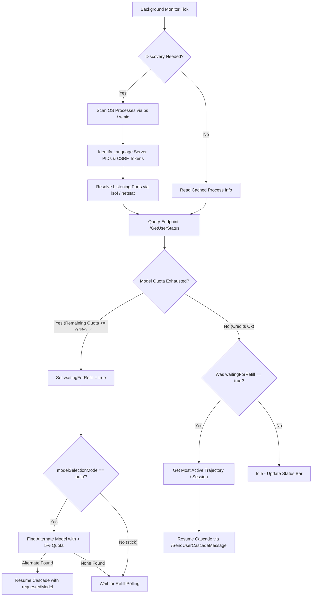

# Architecture & Implementation Details

This document explains how the Antigravity Credit Auto-Resumer extension detects when the agent session is active, identifies credit exhaustion, and handles automated continuation prompts once credits are refilled or model configurations are adjusted.

---

## High-Level Architecture Flow

The auto-resumer runs on a background polling interval. During each tick, it executes process discovery, reads credit balances, evaluates active agent sessions, and triggers continuation actions if quotas reload or alternative models are selected.



---

## Technical Mechanisms

### 1. Process and Dynamic Port Discovery
Before any request is sent, the extension must locate the running Antigravity server and its dynamic communication ports.
* **Command Scanning**: In [process-detector.ts](file:///Users/arjan/personal/agy_continue_when_new_credits/src/process-detector.ts), the [detectProcesses](file:///Users/arjan/personal/agy_continue_when_new_credits/src/process-detector.ts#L13) function runs a dynamic OS process check (`ps -ax` on macOS/Linux or `wmic` on Windows) to search for command lines with `language_server` and `--csrf_token`.
* **Port Resolution**: In [resolvePortsForPid](file:///Users/arjan/personal/agy_continue_when_new_credits/src/process-detector.ts#L87), the tool scans listening TCP ports associated with the language server PID (`lsof -nP -iTCP -sTCP:LISTEN -p <pid>` on macOS or `netstat -ano` on Windows).
* **Caching**: Process information (PID, CSRF token, resolved ports) is cached in-memory in [extension.ts](file:///Users/arjan/personal/agy_continue_when_new_credits/src/extension.ts#L13). The extension performs a fast verification tick and only spawns process scanning shell commands if the cache is empty or every fourth tick to minimize CPU overhead.

### 2. Credit and Quota Monitoring
To track credit pools and active model quotas, the extension requests status updates from the language server.
* **Endpoint**: It performs HTTPS POST requests via [queryGetUserStatus](file:///Users/arjan/personal/agy_continue_when_new_credits/src/credit-monitor.ts#L39) to:
  `/exa.language_server_pb.LanguageServerService/GetUserStatus`
* **Security & Protocol**: Requests bypass local self-signed TLS verification errors (`rejectUnauthorized: false`) and provide the necessary Connect protocol and CSRF token headers:
  ```http
  Connect-Protocol-Version: 1
  X-Codeium-Csrf-Token: <discovered-token>
  ```
* **Quota Exhaustion Evaluation**:
  1. The default active model is resolved via `userStatus.cascadeModelConfigData.defaultOverrideModelConfig.modelOrAlias.model`.
  2. The model's `remainingFraction` (quota fraction between 0.0 and 1.0) is queried.
  3. In [processTick](file:///Users/arjan/personal/agy_continue_when_new_credits/src/auto-resumer.ts#L34), if `remainingFraction <= 0.001` (meaning quota is $\le$ 0.1%), the model is classified as exhausted. The status bar background shifts to warning/error, and the extension transitions into a `waitingForRefill` state.

### 3. Active Session (Trajectory) Detection
To resume the correct conversation, the system must identify the conversation that was active when the credits ran out.
* **Endpoint**: The extension fetches conversation metadata by calling [getAllTrajectories](file:///Users/arjan/personal/agy_continue_when_new_credits/src/auto-resumer.ts#L224) targeting:
  `/exa.language_server_pb.LanguageServerService/GetAllCascadeTrajectories`
* **Active Conversation Heuristics**: In [resumeActiveCascade](file:///Users/arjan/personal/agy_continue_when_new_credits/src/auto-resumer.ts#L170), the extension searches through all returned trajectories, targeting the one with the latest `lastModifiedTime` or `lastUserInputTime` timestamp. If no timestamps are present, it falls back to the first trajectory in the list.

### 4. Automated Continuation Trigger
When the resumer decides to continue the session (either because the quota refilled or an alternative model was selected):
* **Endpoint**: It sends an HTTP POST request to:
  `/exa.language_server_pb.LanguageServerService/SendUserCascadeMessage`
* **Payload Structure**:
  ```json
  {
    "message": "continue",
    "selectedCascadeId": "<active-trajectory-id>",
    "requestedModel": {
      "model": "<selected-model-id>"
    },
    "metadata": {
      "ideName": "antigravity",
      "extensionName": "antigravity",
      "locale": "en"
    }
  }
  ```
* **Status Updates & Logs**: Upon successful resumption, notifications are displayed to the user via toast messages, and operations are logged in the dedicated `Antigravity Credit Resumer Activity` output channel.

---

## Sleep / Suspend & Power Management Behavior

For overnight execution or long-term automated runs, it is critical to understand how the extension interacts with host power-saving states (sleep, suspend, and wake-up cycles).

### 1. The Sleep / Standby Freeze
When the host computer enters a sleep, standby, or suspend state:
* **Timer Deactivation**: The CPU pauses, freezing the Node.js event loop in the VS Code extension host. All background checking intervals (`setInterval`) are paused.
* **No Auto-Wake**: The extension runs in standard user-space and does NOT have administrative access to schedule hardware Real-Time Clock (RTC) wake timers (e.g. `pmset` on macOS or waitable timers on Windows). It cannot wake the computer up when credit refills occur.

### 2. Automatic Wake-up Resumption Lifecycle
When the user manually wakes the laptop (e.g., opening the lid or pressing a key):
1. **Immediate Evaluation Tick**: The JavaScript engine resumes the event loop, registers that the interval has elapsed, and immediately runs one sweep of `pollIntervalTick()`.
2. **Network Delays**: If the system wakes up before the network interface (Wi-Fi/Ethernet) reconnects:
   - The local language server fails to fetch the updated credit status from the cloud.
   - The tick logs a warning and remains in the `waitingForRefill` state.
3. **Auto-Recovery**: On the subsequent polling tick (or after network re-association), the query to `/GetUserStatus` succeeds, detects the refill, and triggers `SendUserCascadeMessage` to resume the active cascade automatically.

### 3. Workarounds to Prevent Sleep During Overnight Runs
To ensure cascades run and resume unattended overnight, the computer must be prevented from entering standby:

* **macOS Caffeinate**: Run the native `caffeinate` command in the terminal to keep the OS awake indefinitely:
  ```bash
  caffeinate
  ```
  *(Or `caffeinate -u -t 7200` to prevent sleep for 2 hours).*
* **Windows PowerToys Awake**: Enable the PowerToys Awake utility in the system tray to keep the PC active on-demand.
* **Power Configurations**: Set the computer's plugged-in sleep timer to "Never" in the system settings (while allowing the display to turn off safely).
